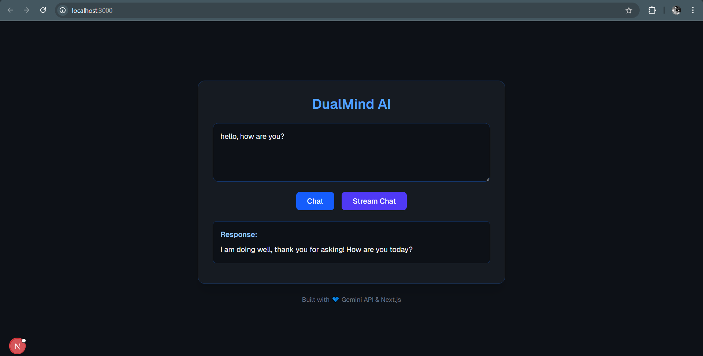
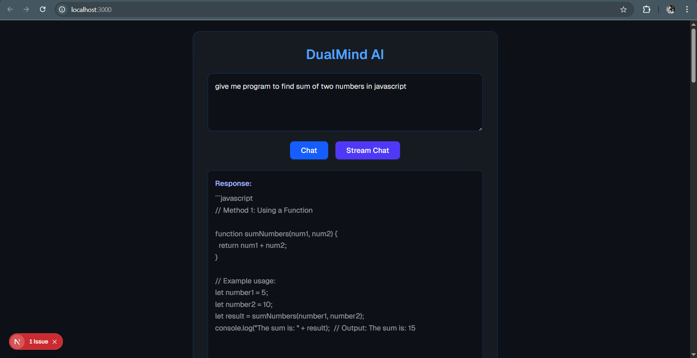

# DualMind AI — Gemini + Next.js Chat App

A modern conversational AI web app built with **Next.js 14**,and **Google’s Gemini API** (`@google/generative-ai`).  
It supports **normal chat** and **real-time streaming chat**, showing how you can connect a React frontend with the Gemini API backend.

---

 ## 🖼 Screenshots

### Main Page



### Main Page




---

## Features

- Interactive chat UI (Ask anything)
- Streaming chat (real-time typing effect)
- Non-stream chat (full response)

## Tech Stack

| Layer | Technology |
|--------|-------------|
| Frontend | Next.js (React + App Router) |
| Styling | Tailwind CSS |
| Backend API | Next.js API Routes |
| AI Engine | Google Gemini API (`@google/generative-ai`) |
| Language | TypeScript / JavaScript |
| Runtime | Node.js |

---

## Folder Structure
```
DualMind/
│
├── app/
│   ├── api/
│   │   ├── chat/
│   │   │   └── route.js            # Non-stream API route
│   │   └── chat-stream/
│   │       └── route.js            # Stream API route
│   │
│   ├── page.jsx                    # Main frontend page
│   └── layout.jsx                  # Root layout
│
├── public/                         # Static assets
├── .env.local                      # Environment variables (Gemini API key)
├── package.json
└── README.md
```
---

## Environment Setup

## 1. **Clone the repository**

   ```bash
   git clone https://github.com/kunj-pandya/DualMind.git
   cd DualMind
   ```

## 2. **Install dependencies**

  ```bash
    npm install
  ``` 


## 3. **Add your Gemini API key**

- Create a .env.local file in the project root and add:

  ```bash
    GEMINI_API_KEY=YOUR_GOOGLE_API_KEY
  ```

- You can get your API key from:
- https://makersuite.google.com/app/apikey

## 4. **Run the development server**
 ```bash
    npm run dev
  ```

## 5. **Visit in browser**

http://localhost:3000

---

## Author

**Kunj Pandya**  
Built with 💙 using Next.js + Gemini AI  
📧 **kunjpandya998@gmail.com**  
[GitHub Profile](https://github.com/kunj-pandya)